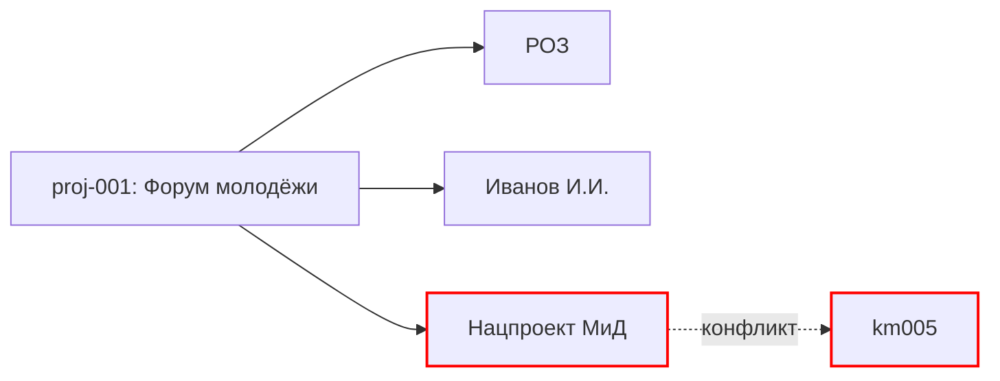

# graph — Визуализация графа связей

## Назначение

Собрать данные из всех карточек воркспейса и отрендерить интерактивный
HTML-граф + статический Mermaid. Визуализирует:

- Проекты ↔ сущности (люди, орги)
- Паттерны ↔ механизмы ↔ ошибки
- Карты знаний ↔ домены
- Кластеры проектов (подсвечиваются)
- Conflict-edges (красным, из аудитов)

## Когда запускается

- Явная команда пользователя (`покажи граф`, `обнови граф`).
- Post-write hook после изменений в `03_projects_registry`, `07_global_entities`,
  `12_cross_project_graph`, `14_audit_log` (с debounce 3-5 сек).
- После [[init]] / [[migrate]] — обязательно.

## Когда НЕ запускается

- Воркспейс пустой (нет записей) → показать placeholder «граф пуст».
- Hook сработал слишком часто (debounce блокирует) → пропустить.

## Исполнитель

Главный скрипт скилла — `scripts/render_graph.py`. Вызывается из двух
контекстов:

| Контекст | Команда | Таймаут |
|---|---|---|
| Post-write hook | `render_graph.py --workspace ${CLAUDE_WORKSPACE:-.} --if-changed` | 5 сек |
| Явный запрос | `render_graph.py --workspace <path> [--project=<id>] [--domain=<d>] [--conflict-only] [--mermaid-only] [--offline]` | без лимита |

Ключевые флаги:
- `--if-changed` — пропуск рендера, если нет новых изменений с прошлого прохода (экономит CPU в hook-режиме).
- `--offline` — inline vis-network вместо CDN (для сред без интернета).
- `--project`, `--domain`, `--conflict-only`, `--mermaid-only` — описаны в секции «Режимы» ниже.

Вспомогательные скрипты скилла:
- `scripts/paginate_projects.py` — под-графы по доменам при > 500 узлах (см. «Производительность»).
- `scripts/render_mermaid.py` — standalone mermaid-рендер (используется скриптом render_graph при `--mermaid-only`).

Полный алгоритм — ниже в «Workflow». Исходники: `~/Documents/Claude/dev/claude-cognitive-os/scripts/render_graph.py`.

## Workflow

### 1. Сбор узлов (nodes)

Проходим по карточкам и собираем узлы всех типов воркспейса: `project`,
`entity_person`, `entity_org`, `pattern`, `mechanism`, `error`,
`knowledge_map`, `lesson`, `domain`, `cluster`, `audit`, `sr`, `term`.

**Источник истины для цветовой палитры и полного перечня типов —
[[cognitive-os-graph#Палитра узлов]]** (reference-скилл). Этот action-скилл
наследует палитру оттуда без дублирования; при изменении палитры правится
только cognitive-os-graph.

### 2. Сбор рёбер (edges)

Парсинг wikilinks `[[target]]` из всех карточек:

| Тип ребра | Стиль | Источник |
|---|---|---|
| `shared_entity` | сплошная | auto из cross-links |
| `shared_domain` | пунктир | `03_projects_registry.domain` |
| `shared_methodology` | сплошная | wm-XXX ссылки |
| `shared_artefact` | пунктир | общие документы |
| `sequential` | стрелка | `parent/child/precedes` |
| `conflict` | красная | `14_audit_log` conflict-edges |

### 3. Фильтры интерактивного HTML

На панели слева:
- Фильтр по типу узла (чекбоксы).
- Фильтр по кластеру (из `12_cross_project_graph`).
- Фильтр по домену.
- Поиск по имени (live-search).
- Скрыть/показать conflict-edges.

### 4. Рендер graph.html (vis-network)

Единый HTML-файл со встроенным vis-network (с CDN или inline).

**Шаблон генерации:**

```html
<!DOCTYPE html>
<html lang="ru">
<head>
  <meta charset="UTF-8">
  <title>Когнитивный граф — {{WORKSPACE_NAME}}</title>
  <script src="https://unpkg.com/vis-network/standalone/umd/vis-network.min.js"></script>
  <style>
    body { font-family: -apple-system, sans-serif; margin: 0; }
    #mynetwork { width: 100%; height: 90vh; border: 1px solid #ccc; }
    #filters { padding: 1em; background: #f4f4f4; }
    .legend { display: flex; gap: 1em; padding: 0.5em; }
    .legend span { padding: 0.25em 0.75em; border-radius: 4px; color: white; }
  </style>
</head>
<body>
  <div id="filters">
    <!-- чекбоксы типов, поиск, кластеры -->
  </div>
  <div id="mynetwork"></div>
  <script>
    const nodes = new vis.DataSet([ /* ... */ ]);
    const edges = new vis.DataSet([ /* ... */ ]);
    const options = {
      nodes: { shape: 'dot', size: 16 },
      edges: { smooth: true },
      physics: { stabilization: true, barnesHut: { gravitationalConstant: -5000 } },
      interaction: { hover: true, tooltipDelay: 200 }
    };
    new vis.Network(document.getElementById('mynetwork'), { nodes, edges }, options);
    // фильтры
  </script>
</body>
</html>
```

### 5. Рендер graph.mermaid (fallback)

Статический текстовый граф в Mermaid-синтаксисе для случаев, когда
HTML недоступен (например, просмотр через plain-text редактор).



### 6. Валидация

- Все узлы имеют ID.
- Нет «висячих» рёбер (target не существует).
- Если есть висячее ребро — фиксируется в `14_audit_log` как
  `regression` (М25) или `knowledge_conflict`.

### 7. Запись

- `_generated/graph.html` — перезапись.
- `_generated/graph.mermaid` — перезапись.
- Старую версию не храним (Obsidian всё равно увидит изменения).

### 8. Уведомление пользователю

```
Граф перестроен.
Узлов: 127 (12 проектов, 31 сущность, 7 паттернов, ...).
Рёбер: 204 (в т.ч. 2 conflict-edges — см. [[14_audit_log#audit-005]]).
Открыть: computer:///Users/.../cognitive_os/_generated/graph.html
```

## Режимы

### `graph` (default)

Полный граф всех узлов.

### `graph --project=<id>`

Ego-граф одного проекта (он + его соседи на расстоянии 2).

### `graph --domain=<domain>`

Фильтр по домену.

### `graph --conflict-only`

Только conflict-edges + их концы.

### `graph --mermaid-only`

Только mermaid, без HTML (быстро).

## Команды

| Команда | Действие |
|---|---|
| `покажи граф` | Перестроить + показать ссылку |
| `обнови граф` | Алиас |
| `перерисуй граф` | Алиас |
| `покажи граф проекта X` | `--project=X` |
| `покажи противоречия на графе` | `--conflict-only` |

## Интеграции

- [[cog-detector]] — при обнаружении нового кластера триггерит перерисовку.
- [[12_cross_project_graph]] — кластеры подсвечиваются отдельным цветом.
- [[14_audit_log]] — conflict-edges красным.
- [[backlinks]] — использует тот же сбор wikilinks для консистентности.
- `hooks/hooks.json` — post-write на карточки → этот скилл (debounce 3 сек).

## Производительность

Источник истины — [[cognitive-os-graph#Производительность]] (reference).
Там единая таблица (< 100 / 100-500 / 500-2000 / > 2000) с пороговыми
значениями и рекомендациями (`paginate_projects.py`, под-графы по
доменам, inline vis-network в `--offline` режиме).

## Верификация

**П13 «Аудитор»** — после рендера проверка:
- №22 согласованность файлов (все ссылки работают).
- №32 ссылочная целостность (нет висячих).

## Частые ошибки

1. **Висячие рёбра** (ссылка на несуществующий ID) → фиксация в audit.
   Защита: шаг 6.
2. **Слишком много узлов** → тормоза в браузере. Защита: пагинация.
3. **CDN недоступен** → HTML не работает. Защита: inline vis-network
   (опция `--offline`).

## Связанные

- [[backlinks]] — парный скилл для обратных ссылок.
- [[cog-detector]] — subagent, дёргающий перерисовку.
- [[12_cross_project_graph]] — ручной слой кластеров.
- [[14_audit_log]] — источник conflict-edges.
